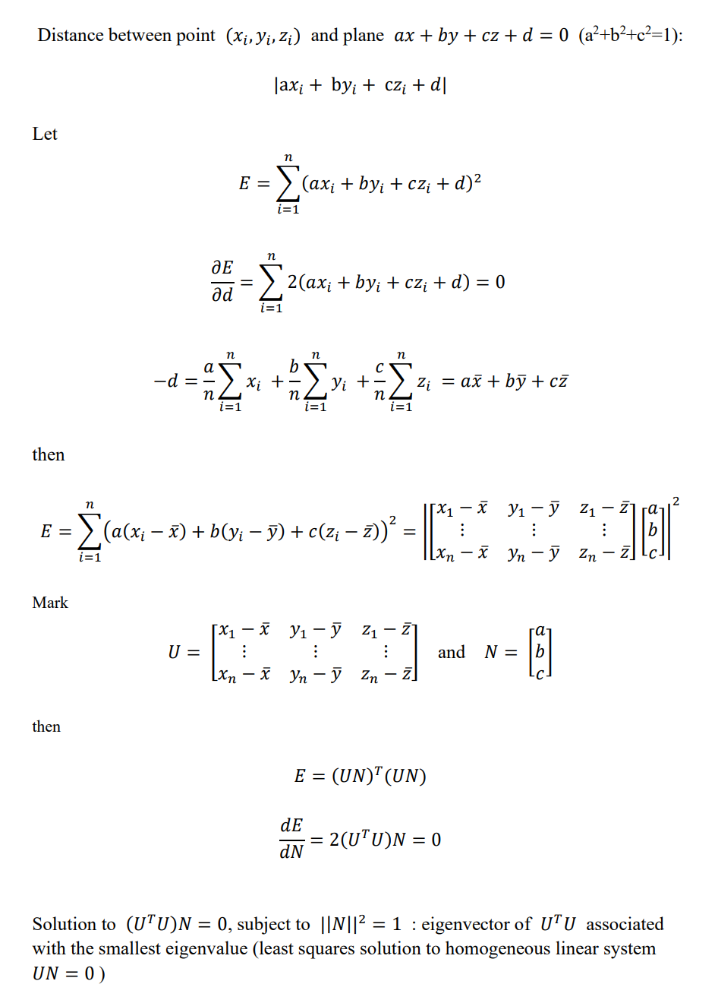
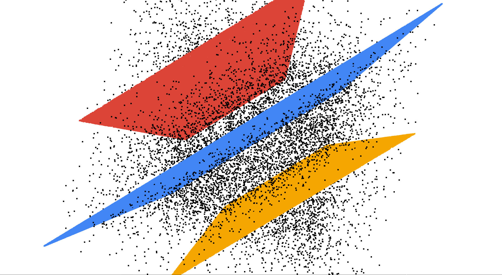

# OpenCV 3D

<br>

## Brief

This repository implements some algorithms related to point clouds and is developed based on [OpenCV](https://github.com/opencv/opencv).

<br>

## Quick Start

```shell
git clone https://github.com/Ryyyc/opencv_3d.git
mkdir opencv_3d/build && cd opencv_3d/build
cmake ..
make
./opencv_3d ../data/Cassette_GT_.ply-sampled-0.2.ply
```

<br>

#### OpenCV configuration

Please make sure to have an OpenCV environment, or see [OpenCV installation tutorial](https://docs.opencv.org/4.5.1/df/d65/tutorial_table_of_content_introduction.html).

If [cmake](https://cmake.org/) cannot automatically detect the OpenCV installation path, please set `OpenCV_DIR` before `find_package(OpenCV REQUIRED)` in [CMakeLists.txt](./CMakeLists.txt) file.

```cmake
set(OpenCV_DIR ".../opencv/build/x64/vc15/lib")
```

<br>

#### Visualization of results

This can use [Point Cloud Library](https://pointclouds.org/) or [Open3D](http://www.open3d.org/) to visualize the results.

The following is an example of visualizing using Open3D-Python.

```shell
// install open3d-python in Ubuntu
pip3 install open3d

// Visualize point clouds
python ./samples/misc/python/Pointcloud-Visualization-With-Open3D.py -cloud ./data/Cassette_GT_.ply-sampled-0.2.ply 

// Visualize point clouds with labels
python ./samples/misc/python/Pointcloud-Visualization-With-Open3D.py -cloud ./data/Cassette_GT_.ply-sampled-0.2.ply -label ./data/Cassette_GT_.ply-sampled-0.2.ply-labels.txt
```

<br>

## OpenCV and Point Cloud

#### Point cloud representation

Use data structure `cv::Mat`(size: n x 3) to store point cloud 3D coordinate information

<br>

## Point Cloud Related Algorithms


### Voxel Grid Filter Sampling

Creates a 3D voxel grid (a set of tiny 3D boxes in space) over the input point cloud data, in each voxel (i.e., 3D box), all the points present will be approximated (i.e., downsampled) with the point closest to their centroid.

<br>

### Total Least Squares Plane Estimate

Fit the plane by the Total Least Squares.



pdf in [Total-Least-Squares-in-3D.pdf](./doc/Total-Least-Squares-in-3D.pdf)

<br>

### Random Sample Consensus (RANSAC)

The basic idea of RANSAC is to select many planes by randomly pick 3 points from point cloud, then calculate the number of inlier points within a tolerance threshold for each plane. Finally, the plane matched the most inlier points is the best plane in the point cloud.

The RANSAC algorithm requires that most of the points in the point cloud belong to inlier points of the plane.

<br>

#### Local optimal RANSAC

In the iterative process, the current optimal solution appears, and Lo-RANSAC is performed. 

One method is to sample the calculation plane from the inlier points of the returned result, set a fixed number of iterations (10-20 times) and select the best local result as the improved result.

<br>

#### Update iterations


<br>

#### Normal vector constraint

If the angle between the normal vector of the fitted plane and the normal vector of the constraint is greater than a threshold, the plane is discarded. The normal vector of the plane finally fitted (detected) by the algorithm will meet the given constraints

<br>

### Multi-plane Detection in Point Cloud

Use the optimized RANSAC algorithm to detect a plane from the point cloud, and label the inlier points on this plane, and the unlabeled points are added to the next round of detection. In this way, multi-plane detection is realized.

For very large point cloud (tens of millions of points), down-sampling can be used first to reduce the point cloud size while maintaining the point cloud characteristics, which will greatly accelerate the plane detection process.

<br>

#### Pseudo-code

```
func RANSAC_PLANE_FIT(point_cloud, thr, iteration, desired_num_planes)
    init array best_planes
    pc_samped = voxel_grid_samping(point_cloud)
    for i in 1...desired_num_planes:
        init best_plane to NULL
        max_inlier_cnt = 0
        for j in 1...iteration:
            plane = random_three_point_fit_plane(pc_samped)
            inlier_cnt = calculate_the_number_of_inlier_points_in_plane(plane)
            if inlier_cnt > max_inlier_cnt:
                best_plane = local_optimal_RANSAC(pc_samped, plane)
                max_inlier_cnt = inlier_cnt
                iteration = update_iteration(max_inlier_cnt)
        add best_plane to array best_planes
        label inlier points of best_plane and remove them from pc_samped

    init array result
    for best_plane in best_planes:
        plane_fit = local_optimal_RANSAC(point_cloud, plane)
        add plane_fit to array result
        label inlier points of plane_fit and remove them from point_cloud
    return array result
```

<br>

#### Samples Dataset

Point cloud data [Cassette_GT_.ply-sampled-0.2.ply](./data/Cassette_GT_.ply-sampled-0.2.ply) comes from [IQmulus & TerraMobilita Contest](http://data.ign.fr/benchmarks/UrbanAnalysis), the down-sampled version of [Cassette_idclass](http://data.ign.fr/benchmarks/UrbanAnalysis/download/Cassette_idclass.zip).

Point cloud data [check.ply](./data/check.ply) is generated by standard plane equations and noise points are added. Author [Zoom1111](https://github.com/Zoom1111).

<br>

#### Result images

Cassette_GT_.ply-sampled-0.2.ply


<br>

check.ply

